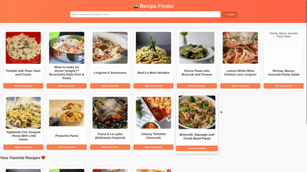

# project 2

This project consists of three separate applications:
1. **Recipe App**: Search and display recipes using Spoonacular API.
2. **Movies App**: Search and display movies using TMDb API.
3. **Weather App**: Search and display weather data using OpenWeatherMap API.

Each app uses HTML, CSS, and JavaScript for fetching and displaying data dynamically.

## Features

### 1. Recipe App
- **Search**: Search by ingredients or dish names with auto-suggest.
- **Recipe Cards**: Display recipes with images, names, and prep times.
- **Recipe Details**: Ingredients, instructions, and nutritional info in a modal.
- **Favorites**: Save recipes to local storage.

**API**: Spoonacular Recipe API  

### 2. Movies App
- **Search**: Search by movie title with auto-suggest.
- **Movie Cards**: Display movies with posters, titles, and release dates.
- **Movie Details**: Show synopsis, cast, ratings, and trailers.
- **Watchlist**: Save movies to local storage.

**API**: TMDb API  

### 3. Weather App
- **Search**: Search by city name with auto-suggest.
- **Current Weather**: Show temperature, humidity, wind speed, and conditions.
- **5-Day Forecast**: Display high/low temps and weather icons.
- **Location**: Use geolocation for weather info.
- **Unit Toggle**: Toggle between Celsius and Fahrenheit.

**API**: OpenWeatherMap API  

## Screenshots

  

  

